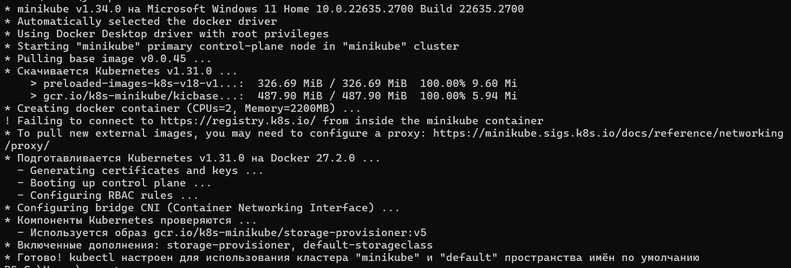
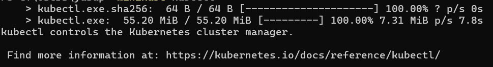
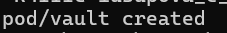
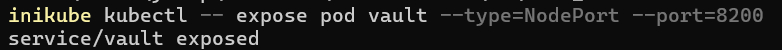
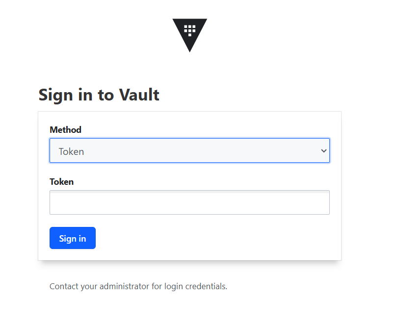
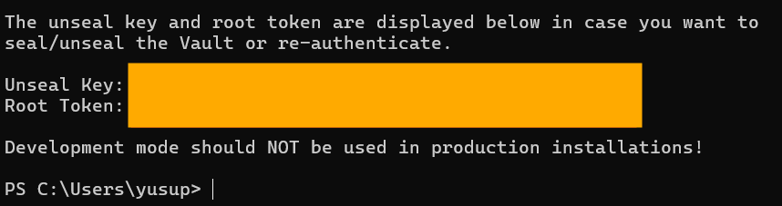
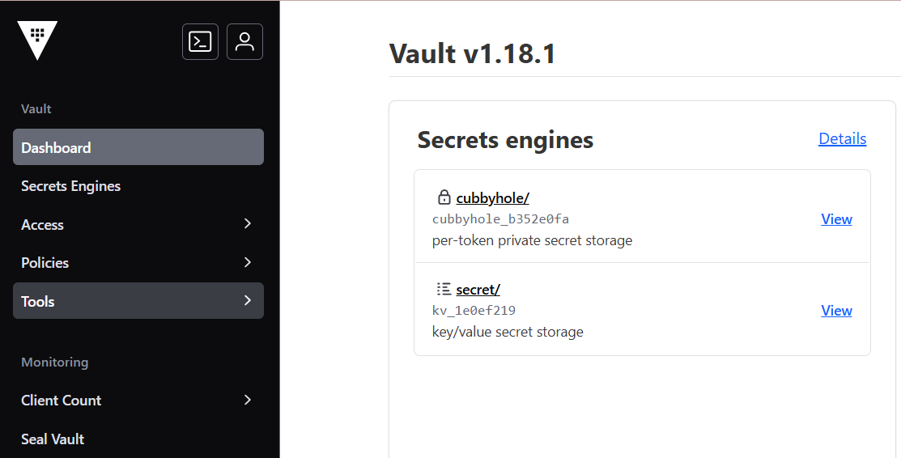
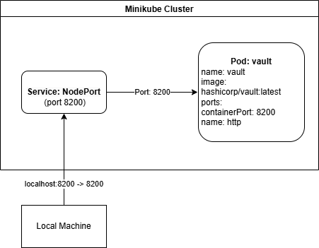

University: [ITMO University](https://itmo.ru/ru/)  
Faculty: [FICT](https://fict.itmo.ru)  
Course: [Introduction to distributed technologies](https://github.com/itmo-ict-faculty/introduction-to-distributed-technologies)  
Year: 2024/2025  
Group: K4111c  
Author: Iusupova Edna Eduardovna  
Lab: Lab1  
Date of create: 10.11.2024  
Date of finished: 04.12.2024   

## Лабораторная работа №1 "Установка Docker и Minikube, мой первый манифест."  
#### Описание  
Это первая лабораторная работа в которой вы сможете протестировать Docker, установить Minikube и развернуть свой первый "под".  

#### Цель работы  
Ознакомиться с инструментами Minikube и Docker, развернуть свой первый "под".  

#### Выполнение работы
##### Шаг 1. Установка Docker
[Docker installer](https://docs.docker.com/desktop/setup/install/windows-install/)

##### Шаг 2. Установка Minikube
[minikube installer](https://minikube.sigs.k8s.io/docs/start/?arch=%2Fwindows%2Fx86-64%2Fstable%2F.exe+download)

##### Шаг 3. Развертывание minikube cluster 
`minikube start`


`minikube kubectl`

##### Шаг 4. Написание манифеста для развертывания "пода"
```yaml
apiVersion: v1
kind: Pod
metadata:
  name: vault
  labels:
    app: vault
spec:
  containers:
  - name: vault
    image: hashicorp/vault:latest
    ports:
    - containerPort: 8200
      name: http
```

##### Шаг 5. Создание сервиса

Развертывание пода
`minikube kubectl -- apply -f C:\Users\yusup\OneDrive\'Рабочий стол'\DT\2024_2025-introduction_to_distributed_technologies-k4111c-iusupova_e_e\lab1\vault-pod.yaml`



Создание сервиса Kubernetes для доступа к контейнеру Vault доступным через NodePort, что позволяет обращаться к поду vault извне кластера.
`minikube kubectl -- expose pod vault --type=NodePort --port=8200` 


Проброс портов:  связь локального порта 8200 компьютера с портом 8200 сервиса vault, что позволяет получить доступ и отправлять команды Vault по адресу http://localhost:8200  
`minikube kubectl -- port-forward service/vault 8200:8200`
(http://localhost:8200)


После запуска Vault генерирует начальный (root) токен для первой аутентификации. С этим токеном можно войти в систему и управлять настройками Vault, например, создавать новые токены или записывать секретные данные.

Поиск токена
Токен для входа в Vault можно найти в логах пода Vault сразу после его запуска. Когда Vault запускается впервые, он выводит начальный токен (root token) в логи. Этот токен дает полный доступ к Vault и позволяет выполнять административные задачи.
`minikube kubectl -- logs pod/vault`


Токен: hvs.U2xpoXWwbfDYqTYgwM6Aj9be


  
   
#### Схема организации контейеров и сервисов


