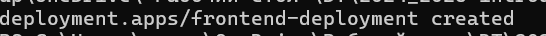
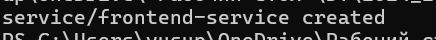
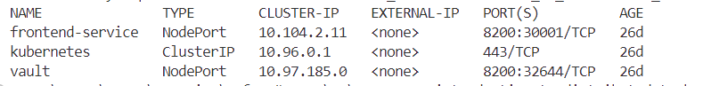
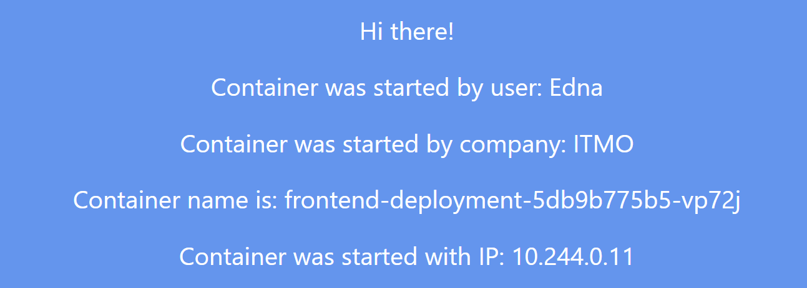
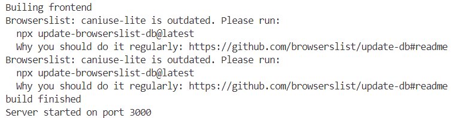
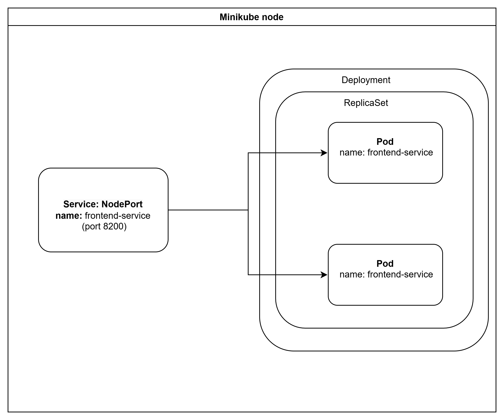

University: [ITMO University](https://itmo.ru/ru/)  
Faculty: [FICT](https://fict.itmo.ru)  
Course: [Introduction to distributed technologies](https://github.com/itmo-ict-faculty/introduction-to-distributed-technologies)  
Year: 2024/2025  
Group: K4111c  
Author: Iusupova Edna Eduardovna  
Lab: Lab2  
Date of create: 07.12.2024  
Date of finished:   

## Лабораторная работа №2 "Развертывание веб сервиса в Minikube, доступ к веб интерфейсу сервиса. Мониторинг сервиса."  
#### Описание  
В данной лабораторной работе вы познакомитесь с развертыванием полноценного веб сервиса с несколькими репликами.  

#### Цель работы  
Ознакомиться с типами "контроллеров" развертывания контейнеров, ознакомится с сетевыми сервисами и развернуть свое веб приложение. 

#### Выполнение работы
##### Шаг 1. Cоздание deployment с 2 репликами контейнера ifilyaninitmo/itdt-contained-frontend:master и передача переменных в эти реплики: REACT_APP_USERNAME, REACT_APP_COMPANY_NAME.

```yaml
apiVersion: apps/v1
kind: Deployment
metadata:
  name: frontend-deployment
spec:
  replicas: 2
  selector:
    matchLabels:
      app: frontend
  template:
    metadata:
      labels:
        app: frontend
    spec:
      containers:
      - name: frontend
        image: ifilyaninitmo/itdt-contained-frontend:master
        env:
        - name: REACT_APP_USERNAME
          value: "Edna"  
        - name: REACT_APP_COMPANY_NAME
          value: "ITMO"  
        ports:
        - containerPort: 3000
```

##### Шаг 2. Создание сервиса для доступа к подам
```yaml
apiVersion: v1
kind: Service
metadata:
  name: frontend-service
spec:
  selector:
    app: frontend
  type: NodePort
  ports:
    - protocol: TCP
      port: 8200       
      targetPort: http 
      nodePort: 30001 
```
##### Шаг 3. Применение манифестов и развертывание
`minikube kubectl -- apply -f C:\Users\yusup\OneDrive\'Рабочий стол'\DT\2024_2025-introduction_to_distributed_technologies-k4111c-iusupova_e_e\lab2\frontend-deployment.yaml`


`minikube kubectl -- apply -f C:\Users\yusup\OneDrive\'Рабочий стол'\DT\2024_2025-introduction_to_distributed_technologies-k4111c-iusupova_e_e\lab2\frontend-service.yaml`


 minikube kubectl get svc 
 

##### Шаг 3. Запуск в minikube режим проброса портов и подключитение к контейнерам через веб браузер.

`minikube service frontend-service`

##### Шаг 4. Проверка на странице в веб браузере переменных REACT_APP_USERNAME, REACT_APP_COMPANY_NAME и Container name. 

Изменяются ли они? Если да то почему?
Да, изменяется из-за балансировки между двумя репликами

##### Шаг 5. Проверка логов контейнеров
`minikube kubectl logs frontend-deployment-5db9b775b5-gcztl`  

  
   
#### Схема организации контейеров и сервисов



