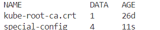
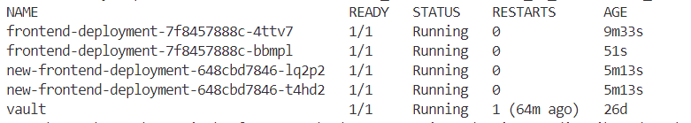
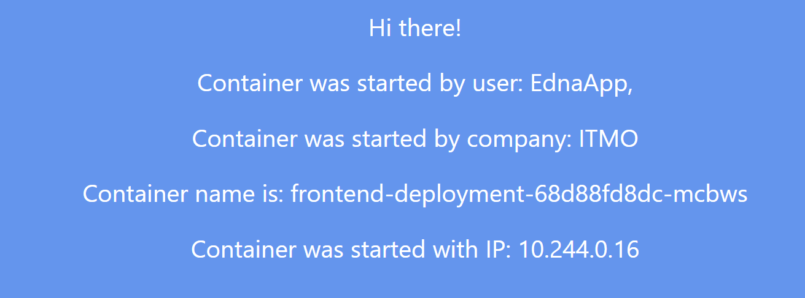
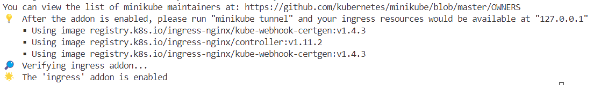
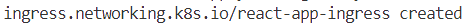
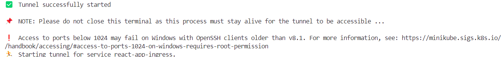
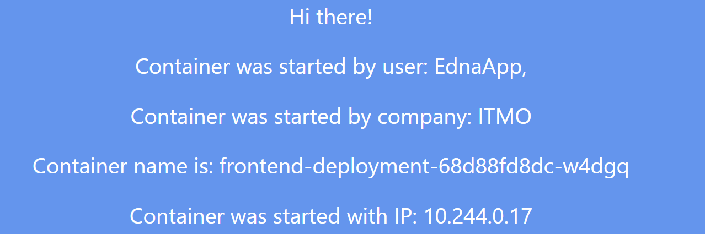
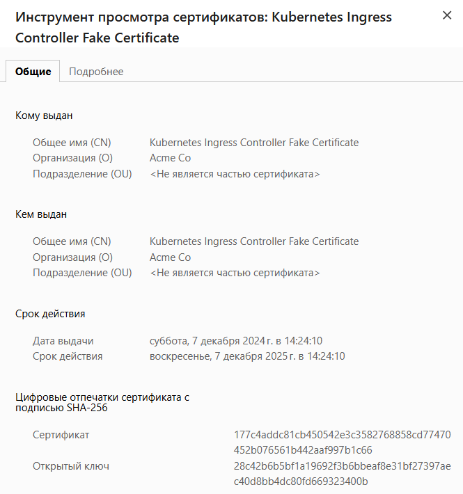

University: [ITMO University](https://itmo.ru/ru/)  
Faculty: [FICT](https://fict.itmo.ru)  
Course: [Introduction to distributed technologies](https://github.com/itmo-ict-faculty/introduction-to-distributed-technologies)  
Year: 2024/2025  
Group: K4111c  
Author: Iusupova Edna Eduardovna  
Lab: Lab3  
Date of create: 07.12.2024  
Date of finished:   

## Лабораторная работа №3 "Сертификаты и "секреты" в Minikube, безопасное хранение данных."  
#### Описание  
В данной лабораторной работе вы познакомитесь с сертификатами и "секретами" в Minikube, правилами безопасного хранения данных в Minikube.  

#### Цель работы  
Познакомиться с сертификатами и "секретами" в Minikube, правилами безопасного хранения данных в Minikube. 

#### Выполнение работы
##### Шаг 1. Создание configMap с переменными: REACT_APP_USERNAME, REACT_APP_COMPANY_NAME.

```yaml
apiVersion: v1
kind: ConfigMap
metadata:
  name: special-config
  namespace: default
data:
  SPECIAL_LEVEL: very
  SPECIAL_TYPE: charm
  REACT_APP_USERNAME: EdnaApp, 
  REACT_APP_COMPANY_NAME: ITMO 
  ```

  `minikube kubectl -- apply -f C:\Users\yusup\OneDrive\'Рабочий стол'\DT\2024_2025-introduction_to_distributed_technologies-k4111c-iusupova_e_e\lab3\configmap.yaml`  

  

##### Шаг 2. Создание replicaSet с 2 репликами контейнера ifilyaninitmo/itdt-contained-frontend:master и используя ранее созданный configMap передать переменные REACT_APP_USERNAME, REACT_APP_COMPANY_NAME .

```yaml
apiVersion: apps/v1
kind: Deployment
metadata:
  name: frontend-deployment
spec:
  replicas: 2
  selector:
    matchLabels:
      app: frontend
  template:
    metadata:
      labels:
        app: frontend
    spec:
      containers:
      - name: frontend
        image: ifilyaninitmo/itdt-contained-frontend:master
        envFrom:
        - configMapRef:
            name: special-config
        ports:
        - containerPort: 8200
```
`minikube kubectl -- apply -f C:\Users\yusup\OneDrive\'Рабочий стол'\DT\2024_2025-introduction_to_distributed_technologies-k4111c-iusupova_e_e\lab3\frontend-deployment.yaml`  


`minikube kubectl get po `  


##### Шаг 3. Запуск в minikube режим проброса портов и подключитение к контейнерам через веб браузер. Включение minikube addons enable ingress и генерация TLS сертификата, импортирт сертификата в minikube.

`minikube service frontend-service`


`minikube addons enable ingress`



`openssl req -new -newkey rsa:2048 -nodes -keyout mydomainitmo.key -x509 -days 3650 -config "C:\Users\yusup\OneDrive\Рабочий стол\DT\2024_2025-introduction_to_distributed_technologies-k4111c-iusupova_e_e\lab3\openssl-san.cnf" -out mydomainitmo.crt`

`openssl x509 -in mydomainitmo.crt -noout -text`  

`minikube kubectl -- create secret tls react-app-edna-tls --cert=mydomainitmo.crt --key=mydomainitmo.key`


##### Шаг 4. Создание ingress в minikube, где указан ранее импортированный сертификат, FQDN по которому вы будете заходить и имя сервиса который вы создали ранее.
```yaml
apiVersion: networking.k8s.io/v1
kind: Ingress
metadata:
  name: react-app-ingress
  annotations:
    nginx.ingress.kubernetes.io/ssl-redirect: "true"
spec:
  tls:
  - hosts:
      - mydomainitmo.com    # FQDN
    secretName: react-app-edna-tls  
  rules:
  - host: mydomainitmo.com  # FQDN
    http:
      paths:
      - path: /
        pathType: Prefix
        backend:
          service:
            name: frontend-service
            port:
              number: 8200          
```

Загрузка манифеста Ingress в кластер:  
`minikube kubectl -- apply -f ingress.yaml`


##### Шаг 5. Проверка логов контейнеров В hosts пропишите FQDN и IP адрес вашего ingress и попробуйте перейти в браузере по FQDN имени. 
Прописаны ip адрес и FQDN в /etc/hosts  
`127.0.0.1 mydomainitmo.com`

Выполнена команда для доступа к ingress  
`minikube tunnel`


##### Шаг 6.Вход в веб приложение по FQDN используя HTTPS и проверьте наличие сертификата.
Проверена работоспособность ингресса mydomainitmo.com


Проверена информация об используемом сертификате

   
#### Схема организации контейеров и сервисов


