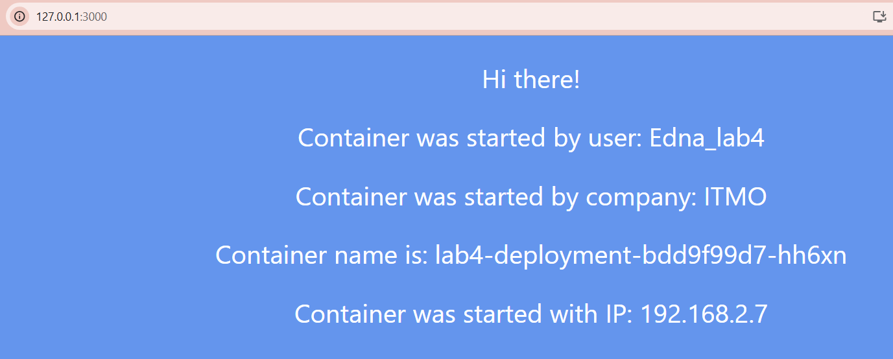

University: [ITMO University](https://itmo.ru/ru/)  
Faculty: [FICT](https://fict.itmo.ru)  
Course: [Introduction to distributed technologies](https://github.com/itmo-ict-faculty/introduction-to-distributed-technologies)  
Year: 2024/2025  
Group: K4111c  
Author: Iusupova Edna Eduardovna  
Lab: Lab4  
Date of create: 07.12.2024  
Date of finished:   

## Лабораторная работа №4 "Сети связи в Minikube, CNI и CoreDNS"  
#### Описание  
Это последняя лабораторная работа в которой вы познакомитесь с сетями связи в Minikube. Особенность Kubernetes заключается в том, что у него одновременно работают underlay и overlay сети, а управление может быть организованно различными CNI.  

#### Цель работы  
Познакомиться с CNI Calico и функцией IPAM Plugin, изучить особенности работы CNI и CoreDNS. 

#### Выполнение работы
##### Шаг 1. Запустить minikube с плагином CNI=calico и режимом работы Multi-Node Clusters, развернуть 2 ноды.

Запуск кластера с 2 нодами и использованием плагина calico  
`minikube start --driver=docker --network-plugin=cni --cni=calico --nodes 2`

##### Шаг 2. Проверить работу CNI плагина Calico и количество нод.

Проверка наличия 2 нод  
`minikube kubectl get no`
```
NAME           STATUS   ROLES           AGE     VERSION
minikube       Ready    control-plane   3m30s   v1.31.0
minikube-m02   Ready    <none>          28s     v1.31.0
```

Проверка установки calico в кластер   
`kubectl get po -l k8s-app=calico-node -A`  
```
NAMESPACE     NAME                READY   STATUS    RESTARTS   AGE
kube-system   calico-node-7b9jv   1/1     Running   0          23m
kube-system   calico-node-d5d4l   1/1     Running   0          28m
```
##### Шаг 3. Создание IPPool для каждой ноды
Просмотр cidr в стандартном ippool  
`kubectl get ippools.crd.projectcalico.org default-ipv4-ippool -o yaml`  
```
cidr: 10.244.0.0/16
```

Удаление стандартного ippool  
`kubectl delete ippools.crd.projectcalico.org default-ipv4-ippool`  
```
ippool.crd.projectcalico.org "default-ipv4-ippool" deleted
```

Добавление меток для нод  
`kubectl label node minikube location=rack1`
```
node/minikube labeled
```
`kubectl label node minikube-m02 location=rack2`
```
node/minikube-m02 labeled
```

Написание ippool для раздачи ip адресов подам, распределенным на ноды с определенным лейблом
``` yaml
apiVersion: crd.projectcalico.org/v1
kind: IPPool
metadata:
  name: rack1-pool
spec:
  cidr: 192.168.1.0/24
  nodeSelector: location == "rack1"
  ipipMode: Always
  natOutgoing: true
---
apiVersion: crd.projectcalico.org/v1
kind: IPPool
metadata:
  name: rack2-pool
spec:
  cidr: 192.168.2.0/24
  nodeSelector: location == "rack2"
  ipipMode: Always
  natOutgoing: true
```
Применение манифеста  
`kubectl apply -f calico-ip-pools.yaml`
```
ippool.crd.projectcalico.org/rack1-pool created
ippool.crd.projectcalico.org/rack2-pool created
```

Проверка создания  IP-пулов  
`kubectl get ippools.crd.projectcalico.org`
```
NAME         AGE
rack1-pool   23s
rack2-pool   23s
```

##### Шаг 4. Создать deployment с 2 репликами контейнера ifilyaninitmo/itdt-contained-frontend:master и передать переменные в эти реплики: REACT_APP_USERNAME, REACT_APP_COMPANY_NAME.

Создание манифеста  
```yaml
apiVersion: apps/v1
kind: Deployment
metadata:
  name: lab4-deployment
spec:
  replicas: 2
  selector:
    matchLabels:
      app: lab4
  template:
    metadata:
      labels:
        app: lab4
    spec:
      containers:
      - name: lab4
        image: ifilyaninitmo/itdt-contained-frontend:master
        env:
        - name: REACT_APP_USERNAME
          value: "Edna_lab4"  
        - name: REACT_APP_COMPANY_NAME
          value: "ITMO"  
        ports:
        - containerPort: 3000
```

Применение манифеста  
`kubectl apply -f frontend-deployment.yaml`
```
deployment.apps/lab4-deployment created
```

##### Шаг 5. Создать сервис, через который будет доступ на эти "поды". Выбор типа сервиса остается на ваше усмотрение.
Создание манифеста  
```yaml
apiVersion: v1
kind: Service
metadata:
  name: frontend-service-4
spec:
  selector:
    app: lab4
  type: NodePort
  ports:
    - protocol: TCP
      port: 3000
      targetPort: 3000
      nodePort: 30008 
 
```

Применение манифеста  
`kubectl apply -f frontend-service.yaml`
```
service/frontend-service-4 created
```

##### Шаг 6. Запустить в minikube режим проброса портов и подключитесь к контейнерам через веб браузер.

`minikube kubectl -- port-forward service/frontend-service-4 3000:3000`  
```
Forwarding from 127.0.0.1:3000 -> 3000
Forwarding from [::1]:3000 -> 3000
Handling connection for 3000
Handling connection for 3000
Handling connection for 3000
Handling connection for 3000
```

##### Шаг 7. Проверить на странице в веб браузере переменные Container name и Container IP. 


Изменяются ли они? Если да то почему?  
Каждый раз при создании нового пода Kubernetes назначает ему уникальный IP-адрес из пула

##### Шаг 8. Используя kubectl exec зайти в любой "под" и попинговать "поды" используя FQDN имя соседенего "пода".
Проверяем, какие поды у нас есть
`kubectl get pods -o wide`
```
NAME                              READY   STATUS    RESTARTS   AGE   IP             NODE           NOMINATED NODE   READINESS GATES
lab4-deployment-bdd9f99d7-hh6xn   1/1     Running   0          13m   192.168.2.7    minikube-m02   <none>           <none>
lab4-deployment-bdd9f99d7-kt9fj   1/1     Running   0          13m   192.168.1.70   minikube       <none>           <none>
```
Протестируем доступность из подов
`kubectl exec lab4-deployment-bdd9f99d7-hh6xn -- ping  192.168.1.70`
```
PING 192.168.1.70 (192.168.1.70): 56 data bytes
```
